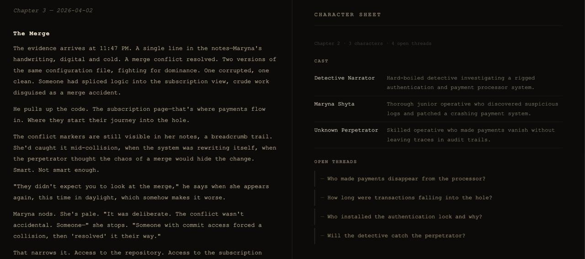

# Noir Commits

> *Every commit tells a story. This one wears a trench coat.*

**Noir Commits** is a VS Code extension that reads your git commits and generates a living **noir detective novel** — chapter by chapter — powered by Claude AI.

Your developers become detectives. Your bugs become crimes. Your refactors become late-night re-examinations of cold case files.

## Features

- Generates a new noir story chapter from each git commit
- Maintains narrative continuity — characters, open threads, and story arcs persist across chapters
- Maps commit types to noir events: bugs are crimes, features are new leads, fixes close cases
- Auto-trigger mode writes a chapter automatically after every commit

## Requirements

An [Anthropic API key](https://console.anthropic.com) is required. Usage is billed to your Anthropic account.

## Getting Started

1. Install the extension
2. Run **Noir Commits: Set API Key** from the Command Palette (`Cmd+Shift+P` / `Ctrl+Shift+P`)
3. Paste your Anthropic API key — it is stored securely in the OS keychain, never in plaintext
4. Open a git repository and run **Noir Commits: Write Next Chapter**

The generated chapter opens immediately in a Markdown preview.

## Commands

| Command | Description |
| --- | --- |
| `Noir Commits: Write Next Chapter` | Generate a chapter from the latest commit |
| `Noir Commits: Set API Key` | Store your Anthropic API key securely |
| `Noir Commits: Remove API Key` | Delete the stored API key |

## Settings

| Setting | Default | Description |
| --- | --- | --- |
| `noirCommits.autoTrigger` | `false` | Automatically write a chapter after each commit |
| `noirCommits.projectDescription` | `""` | A short project description used as narrative backdrop |

## Privacy

- Your API key is stored in the VS Code SecretStorage (OS keychain) — never written to disk or sent anywhere except the Anthropic API
- Story state is saved to `.noir-commits-state.json` in your workspace root — add it to `.gitignore` to keep your story private (the extension generates a `.gitignore` entry automatically)
- Commit messages, author names, and diff stats are sent to the Anthropic API to generate story text

---

*The city doesn't care about your sprint velocity. But it remembers every commit.*
